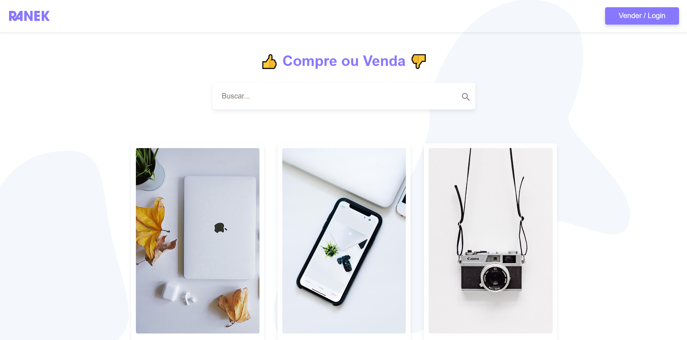

<p align="center">
  
</p>

## Projeto

Sistema web para compra e venda de produtos. Projeto final desenvolvido no curso da [Origamid](https://www.origamid.com/).

### Conceitos abordados

- Consumo de api com o uso da lib [axios](https://github.com/axios/axios).

- Controle de rotas com [Vue Router](https://router.vuejs.org/).

- Controle de estudos e mutações das functions utilizando [Vue X](https://vuex.vuejs.org/).

- Uso de flexbox para alinhar e ajustar elementos na página.

## :rocket: Tecnologias

-  [Vue](https://vuejs.org/guide/introduction.html)
-  [Vue Router](https://router.vuejs.org/)
-  [Vue X](https://vuex.vuejs.org/)
-  [Axios](https://github.com/axios/axios)


<p align="center">
  
</p>

<p align="center">
  
</p>

## 📥 Instalação e execução

## Project setup
```
npm install
```

### Compiles and hot-reloads for development
```
npm run serve
```

### Compiles and minifies for production
```
npm run build
```

### Lints and fixes files
```
npm run lint
```

### Customize configuration
See [Configuration Reference](https://cli.vuejs.org/config/).
